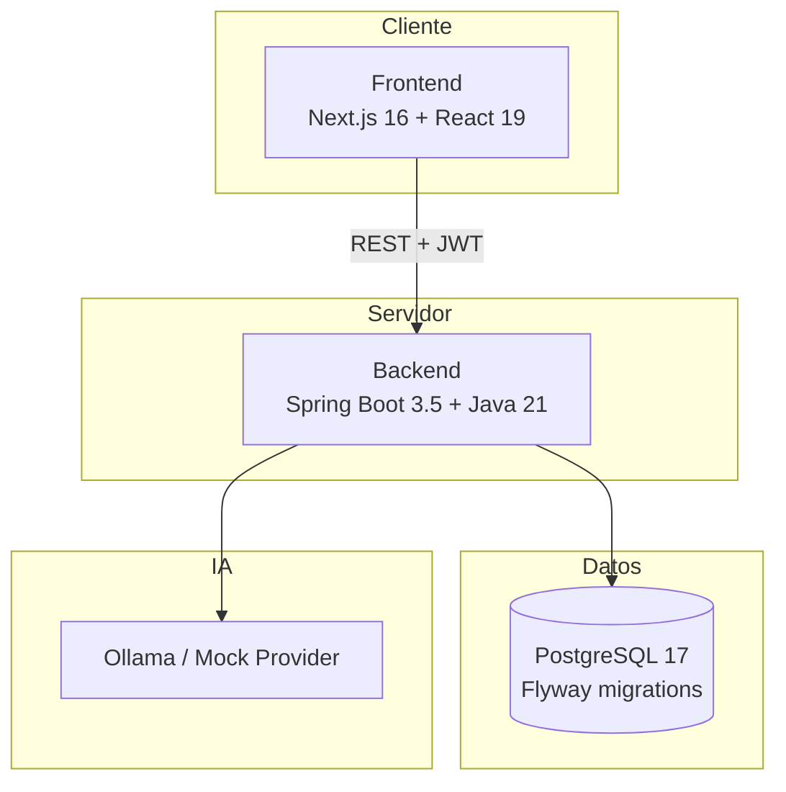

# Ágora — Simulador Psicosocial

**Plataforma académica de simulación clínica interactiva para la formación en psicología social.**

Ágora permite a docentes diseñar casos clínicos, programar actividades, evaluar el desempeño de estudiantes y ofrecer retroalimentación estructurada —incluyendo síntesis asistida por IA— dentro de un entorno seguro, trazable y alineado con resultados de aprendizaje (RDA).

---

## Contexto académico

Este repositorio corresponde al **proyecto nuclear de tercer semestre** del programa de **Ingeniería de Software**, desarrollado en la **CUE Alexander Von Humboldt** como entrega integradora de arquitectura de software, ingeniería de requisitos, bases de datos, interfaces web y calidad de software.

### Equipo de desarrollo

| Integrante |
|------------|
| Valeria Tovar Garzón |
| Esteban Bonilla Giraldo |
| Santiago Leyton |
| Juan Miguel Restrepo Sabogal |
| Keiner Alejandro Devia Mayor |

El proyecto fue construido de forma incremental en **13 fases**, desde la fundación arquitectónica hasta la inteligencia pedagógica, el hardening de seguridad y la documentación de entrega final.

---

## ¿Qué resuelve Ágora?

En programas de psicología, la práctica clínica supervisada es costosa, difícil de escalar y compleja de evaluar de manera homogénea. Ágora digitaliza ese ciclo formativo:

1. El **docente** crea casos clínicos con escenas, preguntas, herramientas y resultados de aprendizaje.
2. **Programa** la actividad en grupos académicos.
3. El **estudiante** realiza la simulación con avatares interactivos y estados emocionales dinámicos.
4. El sistema registra el **intento**, calcula la **nota (0–5)**, genera **feedback** y opcionalmente una **síntesis IA**.
5. El docente consulta **métricas pedagógicas**, cumplimiento de RDA y evolución longitudinal del estudiante.

```
Caso → RDA → Programación → Simulación → Intento → Nota → Feedback → Métricas
```

---

## Arquitectura general

Ágora adopta un **monolito modular**: un único despliegue con fronteras claras entre dominios de negocio, validadas con ArchUnit para evitar dependencias circulares.



| Capa | Tecnología | Responsabilidad |
|------|------------|-----------------|
| **Frontend** | Next.js 16, TypeScript, Tailwind CSS, shadcn/ui, TanStack Query, Zustand | Interfaces por rol, simulador clínico, dashboards |
| **Backend** | Spring Boot 3.5, Spring Security, JPA, Flyway | API REST, reglas de negocio, autorización |
| **Base de datos** | PostgreSQL 17 | Persistencia relacional y trazabilidad académica |
| **IA** | Ollama (local) o proveedor mock | Síntesis pedagógica de intentos |
| **Infraestructura** | Docker Compose | PostgreSQL, pgAdmin y backend containerizado |

Documentación de arquitectura: [`docs/arquitectura/modular-monolith.md`](docs/arquitectura/modular-monolith.md)

---

## Módulos del backend

Cada paquete bajo `com.agora.modules` representa un dominio acotado:

| Módulo | Descripción |
|--------|-------------|
| `auth` | Autenticación JWT, refresh tokens y auditoría de seguridad |
| `user` | Administración de usuarios y roles |
| `academic` | Grupos, matrícula y programaciones |
| `case_management` | Casos clínicos, escenas, preguntas, RDA, herramientas |
| `simulation` | Motor de simulación, intentos, respuestas y estados emocionales |
| `feedback` | Retroalimentación docente y del sistema |
| `ai` | Generación de síntesis pedagógica |
| `metrics` | Métricas clínicas y dashboards pedagógicos |

---

## Frontend

La aplicación web usa **App Router** de Next.js con rutas segmentadas por rol:

| Ruta | Rol | Función |
|------|-----|---------|
| `/dashboard` | Estudiante | Panel personal y acceso a simulaciones |
| `/simulator` | Estudiante / Docente | Catálogo y sesión de simulación clínica |
| `/evaluation` | Estudiante / Docente | Resultados, RDA, comparación docente vs IA |
| `/teacher` | Docente | Grupos, programaciones, casos, métricas |
| `/admin` | Administrador | Usuarios y configuración institucional |

**Características destacadas del simulador:**

- Avatares **Live2D** y animaciones **Rive** para representar al paciente.
- Panel de diálogo clínico con decisiones ramificadas.
- **Consecuencias clínicas inmediatas** tras cada respuesta (mensaje + impacto emocional).
- **Radar pentagonal** (ANSIEDAD, ESTRÉS, CONFIANZA, COOPERACIÓN, RESISTENCIA) desde `estado_intento`.
- Retroalimentación final integral: nota, consecuencias acumuladas, RDA, feedback docente e **IA (Ollama)**.
- Caso oficial académico: *Caso juego social PSICOLOGIA SOCIAL* (5 escenas, 20 decisiones).

Estructura principal:

```
frontend/src/
├── app/              # Páginas y rutas (App Router)
├── modules/          # Vistas por dominio (teacher, evaluation, simulator…)
├── components/       # Design system y componentes del simulador
├── services/         # Clientes HTTP hacia la API
├── hooks/            # TanStack Query y lógica reutilizable
└── types/            # Contratos TypeScript alineados con el backend
```

---

## Base de datos

PostgreSQL almacena el modelo académico completo. Las migraciones **Flyway** (`backend/src/main/resources/db/migration/`) evolucionan el esquema de forma versionada:

| Migración | Contenido |
|-----------|-----------|
| V1–V2 | Seguridad, roles y usuarios de prueba |
| V3 | Grupos y programaciones académicas |
| V4 | Casos clínicos, escenas y preguntas |
| V5 | Motor de simulación e intentos |
| V6 | Bitácora y retroalimentación |
| V7 | Síntesis IA |
| V8 | Calificación 0–5 |
| V9 | Gobierno académico, RDA y rol DOCENTE_ADMIN |
| V10 | Inteligencia pedagógica y datos demo |
| V11 | Corrección Mayor 1 — cursos, usuarios, recuperación de contraseña |
| V12 | Corrección Mayor 2 — consecuencias clínicas, caso oficial, observación pedagógica |

Entidades clave: `usuario`, `grupo`, `programacion`, `caso`, `resultado_aprendizaje`, `intento`, `respuesta`, `retroalimentacion`, `sintesis_ia`.

---

## Roles y permisos

| Rol | Capacidades principales |
|-----|-------------------------|
| **ESTUDIANTE** | Simular casos asignados, ver evaluaciones y progreso propio |
| **DOCENTE** | Gestionar grupos, programar actividades, dar feedback y consultar métricas |
| **DOCENTE_ADMIN** | CRUD completo de casos clínicos, RDA y contenido asociado |
| **ADMINISTRADOR** | Gobierno de usuarios y visión institucional de métricas |

---

## Inicio rápido

### Requisitos

- **Java 21**
- **Node.js 20+** y npm
- **Docker** con acceso al daemon activo

### 1. Configurar entorno

```bash
cp .env.example .env
# Editar credenciales si es necesario
```

### 2. Levantar base de datos y backend

```bash
# Linux — si Docker Desktop no expone el socket por defecto:
export DOCKER_HOST=unix:///var/run/docker.sock

docker compose --profile full up -d --build

# Descargar modelo IA (requerido para síntesis real)
docker exec agora-ollama ollama pull llama3.1:8b
```

Servicios disponibles:

| Servicio | URL |
|----------|-----|
| API REST | http://localhost:8080 |
| Swagger UI | http://localhost:8080/swagger-ui.html |
| Health check | http://localhost:8080/actuator/health |
| Ollama | http://localhost:11434 |
| pgAdmin | http://localhost:5050 |

> **IA (Ollama):** ver [`docs/OLLAMA_RUNBOOK.md`](docs/OLLAMA_RUNBOOK.md) para instalación, modelos y diagnóstico de fallback.

### 3. Levantar frontend

```bash
cd frontend
npm install
npm run dev
```

Aplicación web: **http://localhost:3000**

### 4. Cuentas de demostración

Contraseña para todas las cuentas: `Agora12345*`

| Correo | Rol |
|--------|-----|
| `estudiante@agora.com` | Estudiante |
| `docente@agora.com` | Docente |
| `docente_admin@agora.com` | Docente administrador |
| `admin@agora.com` | Administrador |

---

## Desarrollo local (sin Docker para el backend)

```bash
# Terminal 1 — Base de datos
docker compose up -d postgres pgadmin

# Terminal 2 — Backend
cd backend
./mvnw spring-boot:run -Dspring-boot.run.profiles=dev

# Terminal 3 — Frontend
cd frontend
npm run dev
```

---

## Validación y calidad

```bash
# Backend (desde backend/)
./mvnw test verify package

# Frontend (desde frontend/)
npm run lint
npm run typecheck
npm run build

# Validación runtime de la plataforma
node frontend/scripts/validate-phase13.mjs

# Corrección Mayor 2 — consecuencias, radar, IA, caso oficial
node frontend/scripts/validate-phase-cm2.mjs
```

---

## Estructura del repositorio

```
agora/
├── backend/           # API Spring Boot (monolito modular)
├── frontend/          # Aplicación Next.js
├── database/          # Documentación del modelo de datos
├── docs/              # Entregas por fase y decisiones de arquitectura
├── infrastructure/    # Docker, PostgreSQL, monitoreo
├── scripts/           # Automatización de entorno local
└── docker-compose.yml # Orquestación de servicios
```

Documentación de entrega final: [`docs/FASE13_ENTREGA.md`](docs/FASE13_ENTREGA.md)

---

## Metodología de desarrollo

El proyecto siguió un enfoque por fases con entregas verificables:

1. Fundación y arquitectura modular  
2. Autenticación y seguridad (JWT)  
3. Gestión académica (grupos y programaciones)  
4. Casos clínicos y contenido  
5. Motor de simulación  
6. Bitácora y retroalimentación  
7. Integración de IA  
8. Sistema de calificación 0–5  
9–12. Gobierno académico, RDA, métricas y CRUD avanzado  
13. Inteligencia pedagógica, histórico longitudinal y hardening final  

Cada fase incluyó pruebas automatizadas, scripts de validación runtime y documentación de entrega.

### Corrección Mayor 2 — Núcleo clínico e IA

- **Consecuencias clínicas** por opción (`consecuencia` + `consecuencia_estado`) con impacto inmediato en simulación.
- **Radar emocional pentagonal** desde `estado_intento` (ANSIEDAD, ESTRES, CONFIANZA, COOPERACION, RESISTENCIA).
- **Análisis pedagógico estructurado** (`GET /api/v1/attempts/{id}/pedagogical-analysis`).
- **Caso oficial** *Caso juego social PSICOLOGIA SOCIAL* (migración V12).
- **IA con Ollama** + fallback visible. Ver [`docs/OLLAMA_RUNBOOK.md`](docs/OLLAMA_RUNBOOK.md).

Validación runtime:

```bash
node frontend/scripts/validate-phase-cm2.mjs
```

---

## Licencia y uso académico

Proyecto desarrollado con fines **educativos** en el marco del programa de Ingeniería de Software de la CUE Alexander Von Humboldt.  
Los datos de demostración incluidos en las migraciones son ficticios y están pensados exclusivamente para evaluación académica y presentación del sistema.

---

<p align="center">
  <strong>Ágora</strong> — Formación clínica simulada con trazabilidad académica<br/>
  <em>CUE Alexander Von Humboldt · Ingeniería de Software · Tercer semestre</em>
</p>
